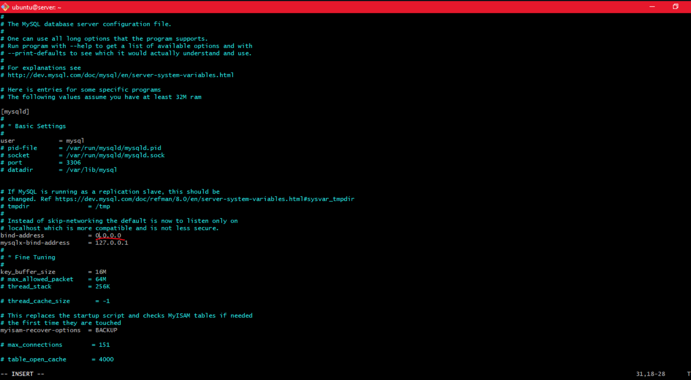

# CLIENT-SERVER ARCHITECTURE WITH MYSQL

**Client-Server** refers to an architecture in which two or more computers are connected together over a network to send and receive requests between one another. In their communication, each machine has its own role: the machine sending requests is usually referred as **"Client"** and the machine responding (serving) is called **"Server"**.

A simple diagram of Web Client-Server architecture is presented below:


In the example above, a machine that is trying to access a Web site using Web browser or simply ‘curl’ command is a client and it sends HTTP requests to a Web server (Apache or any other) over the Internet.

If we extend this concept further and add a Database Server to our architecture:


In this case, our Web Server has a role of a **"Client"** that connects and reads/writes to/from a **Database (DB)** Server (MySQL, MongoDB, Oracle, SQL Server or any other), and the communication between them happens over a Local Network (it can also be Internet connection, but it is a common practice to place Web Server and DB Server close to each other in local network).

To set up a Client-Server Architecture with Mysql using EC2, we need two instances. We will name them:

- Mysql client.
- Msql server.

We set this up by doing the following:

- create an account on [AWS](https://aws.amazon.com/).
- we create two instances by selecting **“ubuntu server 20.04 LTS”** from Amazon Machine Image(AMI)(free tier).
- we select “t2.micro(free tier eligible)”.
- then go to the security group and select “a security group” review and launch.
How to create an aws free tier account. click [here](https://www.youtube.com/watch?v=xxKuB9kJoYM&list=PLtPuNR8I4TvkwU7Zu0l0G_uwtSUXLckvh&index=8)

This launches us into the instances as shown in the screenshot:


We open our terminal and go to the location of the previously downloaded PEM file.

How to download PEM File from AWS. Click [here](https://intellipaat.com/community/52119/how-to-download-a-pem-file-from-aws).

We connect to the instances from two seperate ubuntu terminal using the command:
```
ssh -i devops.pem ubuntu@<IP-address>
```
This automatically connects to the instance.


This done for both the mysql client and mysql server.

After connecting to the instances on each of the terminals, we edit the /etc/hostname/ file to change the names of each of the server so as to align with the given name on the instance i.e client and server respectively. We do this using the command:
```
sudo su
```
then
```
vim /etc/hostname/
```
This opens the hostname file. We then edit the content to suit the given names client and server respectively. We press **ESC :wq and ENTER to save**.

We then run the commands on the client and server terminals respectively.
```
hostname client 
```
 for the client and
```
hostname server 
```
for the server.
we disconnect and reconnect to the instances for these changes to take effect.


On the `client` and `server` terminals we run the command:
```
sudo apt update
```


On the `server terminal`, we install the `mysql server`.
```
sudo apt install mysql-server
```


and on the `client terminal`, we install the `mysql client`.
```
sudo apt install mysql-client
```


We verify the status of mysql by running the command:
```
sudo apt systemctl status mysql
```


By default, both of the `EC2 virtual servers` are located in the same local virtual network, so they can communicate to each other using `local IP addresses`. Use `mysql server's` local IP address to connect from `mysql client`. `MySQL` server uses **TCP port** `3306` by default, so you will have to open it by creating a new entry in **‘Inbound rules’** in **‘mysql server’** *Security Groups*. For extra security, **do not allow** `all` *IP addresses* to reach your **‘mysql server’** – allow access only to the specific local IP address of your **‘mysql client’**.


We need to configure **MySQL server** to allow connections from remote hosts.
```
sudo vi /etc/mysql/mysql.conf.d/mysqld.cnf
```
Replace "bind-address" **‘127.0.0.1’** to **‘0.0.0.0’** like this:



To set up the mysql database in server that the client will be able to connect to, we run the following commands:
```
sudo mysql
```
this lauches us into the mysql database.

Next we run the command:
```
mysql> ALTER USER 'root'@'localhost' IDENTIFIED WITH mysql_native_password BY 'PassWord.1';
```
we exit. Start the interactive script by running:
```
sudo mysql_secure_installation
```

At the prompt we put in the `password` we specified earlier i.e `PassWord.1`. To create a validated `password`, type `y`. Then choose the strength of the new password you want to create-at the prompt, we put in the new password.

Type `y` at the following prompts to validate the changes.


When you’re finished, log in to the MySQL console by typing:
```
sudo mysql -p
```


To create a new database, run the following command from your MySQL console:
```
mysql> CREATE DATABASE `example_database`;
```
we replaced 'example_database' with 'test_database'.

Now you can create a new user and grant him full privileges on the database you have just created.
```
mysql> CREATE USER 'example_user'@'%' IDENTIFIED WITH mysql_native_password BY 'password';
```
we replace **'example_user'** with **'solomon'** and **'password'** with the new password we just created i.e 'Sa4la2xa#'

To give this user (i.e 'solomon') permission over the 'test_database' database:
```
mysql> GRANT ALL ON example_database.* TO 'solomon'@'%';
```
Then, we exit the mysql shell.


To test if the new user has the proper permissions by logging in to the MySQL console again, this time using the custom user credentials:
```
mysql -u solomon -p
```
at the prompt, we put in our password (i.e Sa4la2xa#). then run the command:
```
mysql> SHOW DATABASES;
```


We should be able to access the database.

> [!NOTE] 
> If we are unable to connect to the server, we open the /etc/mysql/my.cnf on the server.
```
vim /etc/mysql/my.cnf
```
Check if we can see **bind-address = 127.0.0.1** if we cant find this, we go and open the **/etc/mysql/mysql.conf.d/ mysqld.cnf**.
```
vim /etc/mysql/mysql.conf.d/mysqld.cnf
```
and comment out the bind-address = 127.0.0.1.

i.e # bind-address = 127.0.0.1

then restart the mysql server
```
sudo systemctl restart mysql
```
We have successfully deployed a fully functional mysql client-server setup.